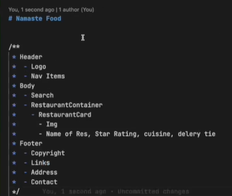

# namaste react #

# parcel

it created below things for us to make our life easy
- Dev Builds
- Local Server
- HMR = HOT MODULE REPLACEMENT
- FILE WATCH ALGORITHM WRITTEN IN CPP
- CACHING--> FASTER BUILDS BECAUSE ALSO DOING CACHING 
- Image optimization
- Minification
- Bundling
- Compress
- Consistent Hashing
- Differential Bundling (Support older browser)
- Diagnostic
- Error Handling
- Host your app in https
- Tree shaking remove unused code for us
- Different dev and prod bundles

Most expensive thing in your web browser to load the images

#Namaste Food

//JSX  - html like or xml like syntax
//React element
// const jsxHeading=(<h1>
//     Namaste React using JSX
//     </h1>
//     );

// Header 
// - Logo, - NAV ITEMS, 
//  Body
//  - Search bar
//  - Restaurant container
//  Footer
// - Copyright
//  - Links, Address,Content
// 
// 
// 

React Hooks
(Normal JS Utility Function)
useState() - super powerfull state varilable

useEffect()

whenever a state variable updates/changes.  React re-render my component. its a super powerful local variable

